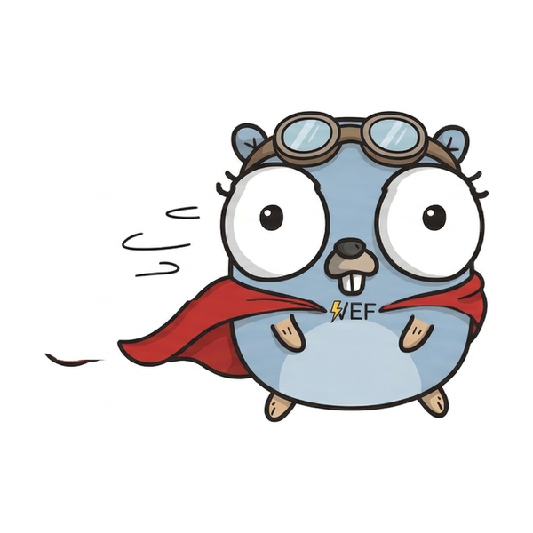

# VEF Framework Go

<p align="center">
  
</p>

📖 [English](./README.md) | [简体中文](./README.zh-CN.md)

[](https://github.com/coldsmirk/vef-framework-go/releases)
[](https://github.com/coldsmirk/vef-framework-go/actions/workflows/test.yml)
[](https://codecov.io/gh/coldsmirk/vef-framework-go)
[](https://pkg.go.dev/github.com/coldsmirk/vef-framework-go)
[](https://goreportcard.com/report/github.com/coldsmirk/vef-framework-go)
[](https://deepwiki.com/coldsmirk/vef-framework-go)
[](https://github.com/coldsmirk/vef-framework-go/blob/main/LICENSE)

VEF Framework Go 是一个面向企业应用的 Go 框架。它把 Uber FX 依赖注入、Fiber HTTP 框架和 Bun 数据访问组合在一起，并内置 API 资源模型、认证鉴权、RBAC、校验、缓存、事件、存储、MCP 等常用能力。

> 本 README 刻意保持简洁。更详细的教程、参考手册和架构说明请查看[文档站点](https://coldsmirk.github.io/vef-framework-go-docs)。

> 当前项目仍处于 1.0 之前的快速迭代阶段，后续仍可能出现破坏性变更。

## 为什么选择 VEF

- 同一套资源模型同时支持 RPC 和 REST
- 为常见后台场景提供泛型 CRUD 构建能力
- 基于 Uber FX 的模块化启动与组装方式
- 内置认证、RBAC、限流、审计等基础能力
- 事件、CQRS、定时任务、Redis、对象存储、Schema、监控、MCP 等基础设施开箱可用

## 快速开始

### 环境要求

- Go 1.26.0 或更高版本
- PostgreSQL、MySQL 或 SQLite 等受支持的数据库

### 安装

```bash
go get github.com/coldsmirk/vef-framework-go
```

### 最小示例

创建 `main.go`：

```go
package main

import "github.com/coldsmirk/vef-framework-go"

func main() {
	vef.Run()
}
```

创建 `configs/application.toml`：

```toml
[vef.app]
name = "my-app"
port = 8080

[vef.data_source]
type = "sqlite"
path = "./my-app.db"
```

这个配置示例是最小可运行版本。项目还支持 `vef.monitor`、`vef.mcp`、`vef.approval` 等更多配置段。

运行应用：

```bash
go run main.go
```

VEF 会从 `./configs`、`.`、`../configs` 或 `VEF_CONFIG_PATH` 指定的位置加载 `application.toml`。

## 核心概念

- `vef.Run(...)` 会启动框架，并按默认链路装配 config、database、ORM、middleware、API、security、event、CQRS、cron、redis、mold、storage、sequence、schema、monitor、MCP、app 等模块。
- API 通过 `api.NewRPCResource(...)` 或 `api.NewRESTResource(...)` 定义资源。
- 业务模块通常通过 `vef.ProvideAPIResource(...)`、`vef.ProvideMiddleware(...)`、`vef.ProvideMCPTools(...)` 等方式接入。
- 如果业务以标准增删改查为主，可以优先使用 `crud/` 中的泛型能力减少样板代码。

典型应用目录：

```text
my-app/
├── cmd/
├── configs/
└── internal/
    ├── auth/
    ├── sys/
    ├── <domain>/
    └── web/
```

## 文档入口

- 文档站点：<https://coldsmirk.github.io/vef-framework-go-docs>
- API 参考：<https://pkg.go.dev/github.com/coldsmirk/vef-framework-go>
- 仓库知识图谱：<https://deepwiki.com/coldsmirk/vef-framework-go>
- 测试规范：[TESTING.md](./TESTING.md)

如果你需要分步骤教程、架构细节或特性级参考，请优先查看[文档站点](https://coldsmirk.github.io/vef-framework-go-docs)，而不是继续膨胀这个 README。

## 开发

常用校验命令：

```bash
go test ./...
go test -race ./...
golangci-lint run
```

仓库根目录提供了发布脚本，但请在明确需要时再使用：

```bash
./release.sh vX.Y.Z "description"
./unrelease.sh vX.Y.Z
```

## 许可证

本项目基于 [Apache License 2.0](./LICENSE) 开源。
